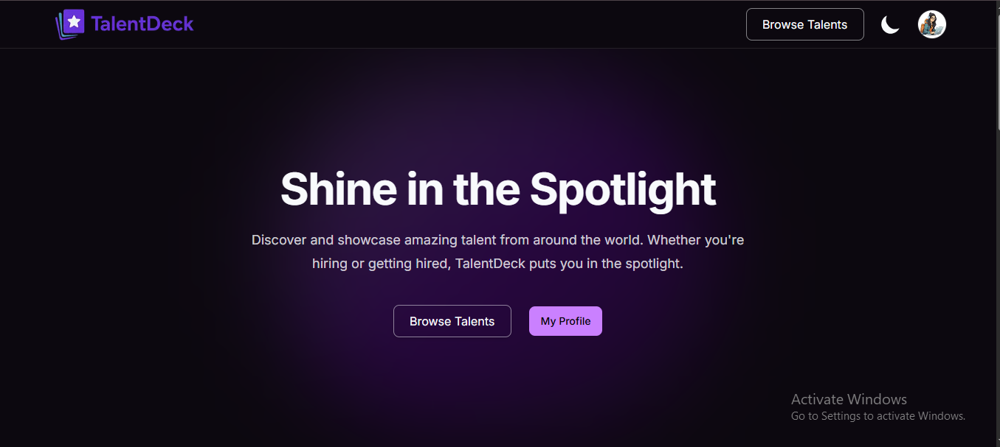
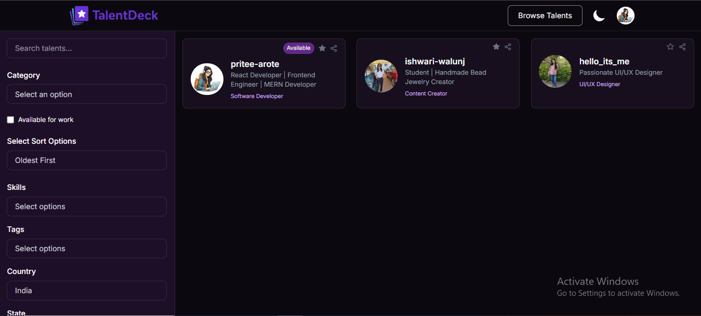
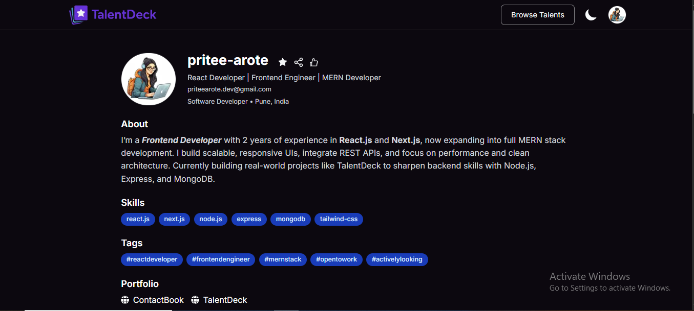
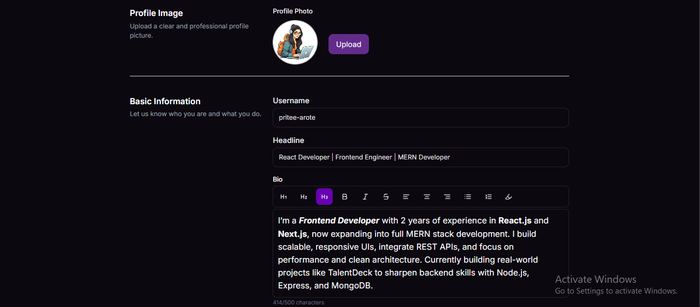

# TalentDeck 💼✨  
> A portfolio-sharing platform for creative professionals & developers to showcase their work, discover talent, and get discovered.

---

## 🔗 Live Demo  
🌐 [Visit TalentDeck](https://talentdeck-next.netlify.app)

---

## 🎯 Project Overview

TalentDeck was built to solve a common problem — finding real, creative talent without noisy platforms. It enables developers, designers, and creators to craft beautiful portfolio profiles and share their work easily. 

Whether you're looking to get hired or explore others’ work, TalentDeck makes it effortless.

---


## 📸 Screenshots

| Homepage | Talent Search | Profile View | Rich Editor |
|---------|----------------|--------------|-------------|
|  |  |  |  |

---

## ✨ Key Features

- 🪪 Beautiful, searchable public profiles (with username slug URLs)
- 📂 Project image uploads (stored on Cloudinary)
- 📍 Tags, skills, category, location-based filtering
- 💖 Like & ⭐ Bookmark profiles
- ✍️ Rich text editor for bio & headline using TipTap
- 🔍 Full talent search: keyword, category, sorting (Latest, Popular, etc.)
- 🌙 Clean, responsive UI with dark mode & UX-first interactions
- 🔐 Auth, route protection, and session-based user experience
- ✅ Profile visibility toggle (public/private)
- ⚡ Real-time feedback using Toasts
- 📱 Fully responsive (mobile-first)

---

## 🛠️ Tech Stack

- **Frontend**: Next.js, TypeScript, TailwindCSS, TipTap Editor, React Hook Form, Shadcn
- **Backend**: Node.js, Express.js, MongoDB, Cloudinary
- **Auth**: JWT + Cookies + Route Protection
- **State**: React Context + Custom Hooks (`useAuth`, `useDarkMode`)
- **Deployment**: Netlify (frontend) + Vercel (backend)

## 🧠 What I Focused On

- Reusable, type-safe components across forms and profile sections.
- Clean codebase structure with scalable folder organization.
- Custom React hooks (`useAuth`, `useDarkMode`) to simplify state and session logic.
- UX-first approach: smooth interactions, dark mode toggle, real-time feedback via toasts.
- Accessibility and mobile-first design considerations.

---

## 🚀 Getting Started

### 1. Clone the repository
```bash
git clone https://github.com/PriteeAr0te/talentdeck.git
cd talentdeck

npm install

NEXT_PUBLIC_BACKEND_URL=
CLOUDINARY_API_KEY=
JWT_SECRET=

npm run dev

```

## 🙌 Feedback & Contribution

Have suggestions or ideas? Feel free to open an issue or reach out.  
If you build your TalentDeck profile, I’d love to see it. Drop your link in the discussions!

